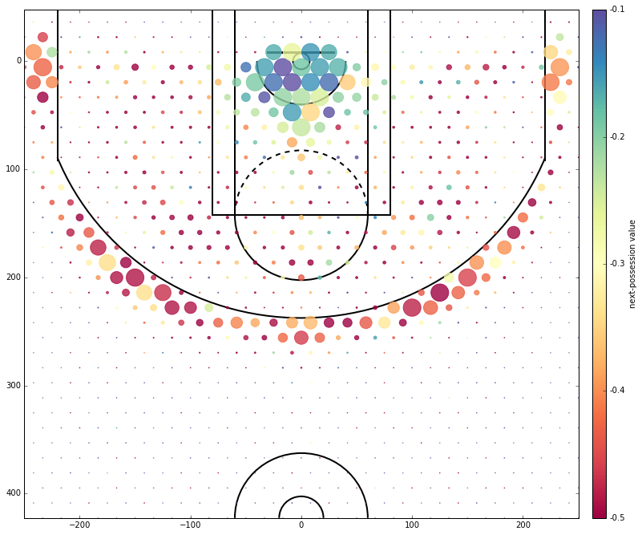

**For details:** See the iPython notebook `nba_scrape.ipynb`.

---

# NBA Cold Maps

NBA shot charts are a popular way of visualizing shooting efficiency across different parts of the basketball court. Some examples include:

* [Region-based](http://i.cdn.turner.com/nba/nba/.element/media/2.0/teamsites/bucks/chart-giannis.png), which separate the court into sections based on angle and distance from the hoop.
* [Scatter plots](http://graphics.latimes.com/kobe-every-shot-ever/), which simply plot every single make and miss.
* [Kirk Goldsberry's / Grantland's hexagonal heat maps](http://grantland.com/the-triangle/courtvision-how-the-heat-and-spurs-score/), charts which visualize four dimensions (x location, y location, volume by hexagon size, and efficiency by hexagon color).

One quirk of these charts is that "misses" are all treated alike; that is, a missed layup is viewed as the same as a missed three. But there is reason to believe this perspective is inappropriate! That is, perhaps a bricked three can lead to a fast break, whereas a missed layup can lead to a offensive putback.

To answer this question with data, I decided to produce *cold maps*, which visualize the *next-possession value* from each part of the floor. That is, for each shot location, I compute the expected point outcome of the subsequent possession conditional on a missed shot (where a positive value represents a point for the shooting/missing team, and a negative value represents a point for the opposing/defending team).

In the above figure, cooler colors represent "safer" shots (i.e., less punishing next-possession value), whereas warmer colors represent "more dangerous" shots (i.e., more negative next-possession value). The size of each cell represents the volume of misses from each court location.

## Other info

The relevant files are:

    gather.py
    draw.py

Prerequisite packages include:

    matplotlib
    numpy
    pandas
    requests

For any questions, bug reports, etc., contact [Steven S. Kim](http://ssk.im) via e-mail at [steven_kim@brown.edu](mailto:steven_kim@brown.edu).
